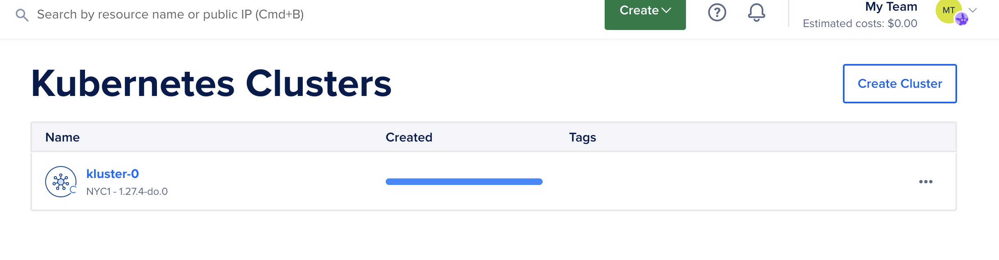
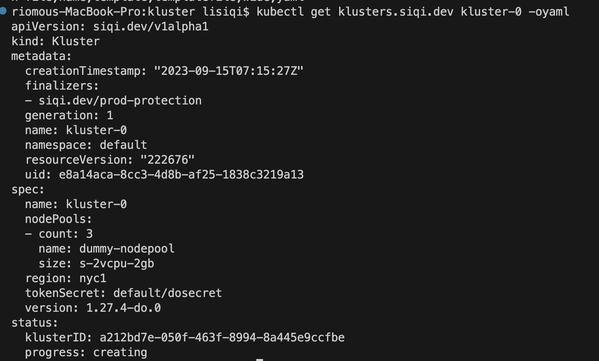

# K8s-Notes

## Goals
 - Trying your hand and writing your own kubernetes controllers,
 - Learning how logging, debugging, etc. works on k8s

## Description

The repo includes two branches: 
- main
- ekspose

The main branch is a Kubernetes Operator, Kluster, for provisioning/destroying k8s cluster on Digitcal Ocean dynamically. Kluster is a new CRD type, with generated DeepCopy functions, clientset, informers and listers for it.

The ekspose branch is a custom Kubernetes controller to watch for the creation and deletion of deployments and create/delete services and ingresses accordingly. 

Both controllers are containerized and deployed with necessary manifests related to roles and service account.

## Files

- controller related files are in "kluster" folder.
- k8s tutorial learning notes are in "Tutorial.md".

## Deployment

If you want to push it to dockerhub, you can use the existing docker file and push it in this way.
```
cd kluster
docker build -t siqili/kluster:0.0.1 .
docker push siqili/kluster:0.0.1 
```
In order to build deployment, you can cd to manifests folder and run:
```
kubectl create -f install
```
In case you are intersted, the kluster deployment and service account related yaml file are generated in this way:
```
kubectl create deployment kluster --image siqili/kluster:0.1.0 --dry-run=client -oyaml > install/deploy.yaml

kubectl create serviceaccount kluster-sa --dry-run=client -oyaml > install/sa.yaml
kubectl create clusterrole kluster-cr --resource kluster --verb list,watch --dry-run=client -oyaml > install/clusterrole.yaml
kubectl create clusterrolebinding kluster-crb --clusterrole k
luster-cr --serviceaccount default:kluster-sa --dry-run=client -oyaml > install/crb.yaml
```

## Run & Test

- Before running this controller, you need to cd to manifests folder

- In order to deploy the controller, you can run:
    - kubectl create -f install
- To monitor the log you can run:
    - to get the pod: kubectl get pods
    - to get the log: kubectl logs KLUSTER_NAME -f
- To test controller, you can run:
    - kubectl create -f kluster0.yaml 
    - kubectl delete kluster.siqi.dev kluster-0
    - (If the delete takes forever you need to add this cmd to make it finish) kubectl patch klusters.siqi.dev/kluster-0 -p '{"metadata":{"finalizers":[]}}' --type=merge
- To list, you can run:
    - kubectl get klusters.siqi.dev
- To clear, you can run: 
    - kubectl delete -f install


## Demo

Below is a demo. 

- The output ofter calling the k8s apis


- The kubectl logs after calling the k8s apis


- The digital ocean control panel after creating the cluster:



- The kluster yaml print after creating the cluster:



## Controller

The controller includes these fields:
- client: kubernetes.Interface used to store and pass the secrete token
- klient: Customized crd klientset.Interface
- kLister: Customized klister.KlusterLister, component of informer to get the resources from cache
- klusterSynced: cache.InformerSynced, to get Status that if the cache is successfully synced
- queue: workqueue.RateLimitingInterface, FIFO queue so we can add objects to queue when Add/delete functions are called
- recorder: record.EventRecorder, event recorder for the cr

You may refer to this img for how they work together:


## Code-generator

We use code generators to generate these functions of crds:

1. deep copy obejcts
2. clientset
3. informers
4. lister

Besides the functions, kluster status is a sub resource, which is useful once reflected in printer column. The controller-gen code add the status to cr by comments.

The cmd to generate the functions and fields is:
```
execDir=/Users/lisiqi/go/pkg/mod/k8s.io/code-generator@v0.28.1
"${execDir}"/generate-groups.sh all kluster/pkg/client kluster/pkg/apis siqi.dev:v1alpha1 --go-header-file /Users/lisiqi/go/pkg/mod/k8s.io/gengo@v0.0.0-20220902162205-c0856e24416d/boilerplate/boilerplate.go.txt
```

## Digital Ocean Tokens

kluster.go has kluster spec, using which our cluster is created in digital ocean. To do that, we create do.go which takes kubenetes clientset (to get the token) and klient.spec and make a request to digital ocean api. After you retrieve your digital ocean token, you need to run 

```
kubectl create secret generic dosecret --from-literal token=DOTOKEN
```
In our implementation, the following interface is created:
- Create
- ClusterState
- getToken
- Delete

## References
- https://github.com/kubernetes/sample-controller
- https://youtu.be/lzoWSfvE2yA?si=gkFn6-qzXi2l7DuG
- https://youtu.be/89PdRvRUcPU?si=KkclMc1QbeiC105f
- https://github.com/zq2599/blog_demos/tree/master
- https://blog.csdn.net/boling_cavalry/article/details/128753781
- https://medium.com/speechmatics/-how-to-write-kubernetes-custom-controllers-in-go-8014c4a04235
- https://cloudark.medium.com/kubernetes-custom-controllers-b6c7d0668fdf#:~:text=You%20can%20write%20custom%20controllers%20that%20handle,you%20can%20add%20new%20custom%20resources%20within
- https://cloud.tencent.com/developer/article/1493250

