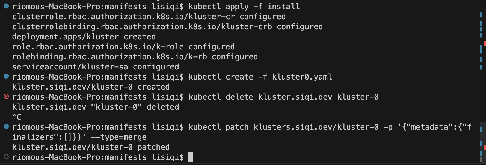
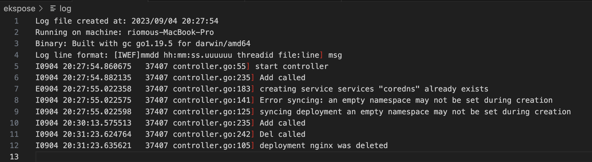

# K8s-Notes

## Goals
 - Trying your hand and writing your own kubernetes controllers,
 - Learning how logging, debugging, etc. works on k8s

## Description

A custom Kubernetes controller to watch for the creation and deletion of deployments and create/delete services and ingresses accordingly. The controller is containerized and deployed with necessary manifests related to roles and service account.

 ## Files

- controller related files are in "ekspose" folder.
- k8s tutorial learning notes are in "Tutorial.md".

## Deployment
```
cd ekspose
docker build -t siqili/ekspose:0.0.1 .
docker push siqili/ekspose:0.0.1 
```

## Run & Test

- Before running this controller, you need to make sure there is a k8s cluster running. You can use "minikube start" or enable docker k8s cluster for the demo.
- In order to create ingress for deployment, you need to run: kubectl apply -f https://raw.githubusercontent.com/kubernetes/ingress-nginx/controller-v0.46.0/deploy/static/provider/do/deploy.yaml
- In order to deploy the controller, you can run:
    - kubectl create -f deployment.yaml
- To monitor the log you can run:
    - to get the pod: kubectl get pods -n ekspose
    - to get the log: kubectl logs -n ekspose
- To test controller, you can run:
    - kubectl create ns ekspose
    - kubectl create deployment nginx -n ekspose --image nginx
    - kubectl delete deployment -n eksposetest nginx
- To list, you can run:
    - kubectl get all -n ingress-nginx
    - kubectl get nodes
    - kubectl get deployments
    - kubectl get service -n eksposetest
    - kubectl get ingress -n eksposetest
- To clear, you can run: 
    - kubectl delete all --all -n ekspose

# Containerization

Service account/Cluster role/Cluster role binding are created in order to run the controller in docker environment.
```
kubectl create serviceaccount ekspose-sa --dry-run=client -oyaml > sa.yaml 
kubectl create clusterrole ekspose-cr --resource deployment --verb list,watch --dry-run=client -oyaml > clusterrole.yaml 
kubectl create clusterrolebinding ekspose-crb --clusterrole ekspose-cr --serviceaccount default:ekspose-sa --dry-run=client -oyaml > crb.yaml
```

## Demo

Below is a demo. 

- The output ofter calling the k8s apis



- The kubectl logs after calling the k8s apis



## References
https://cloud.tencent.com/developer/article/1493250
https://github.com/kubernetes/sample-controller
https://github.com/zq2599/blog_demos/tree/master
https://blog.csdn.net/boling_cavalry/article/details/128753781
https://medium.com/speechmatics/how-to-write-kubernetes-custom-controllers-in-go-8014c4a04235
https://cloudark.medium.com/kubernetes-custom-controllers-b6c7d0668fdf#:~:text=You%20can%20write%20custom%20controllers%20that%20handle,you%20can%20add%20new%20custom%20resources%20within
https://youtu.be/lzoWSfvE2yA?si=gkFn6-qzXi2l7DuG
